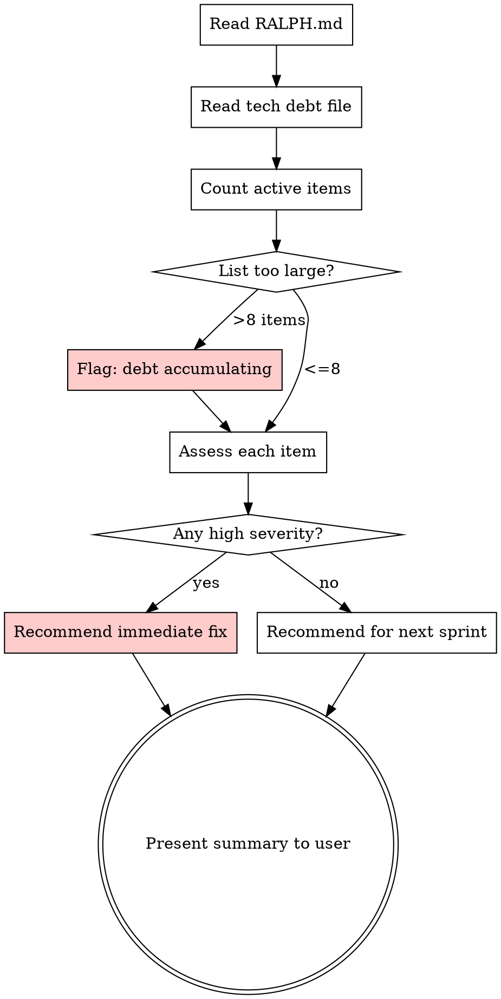

# /tech-debt-review — Tech Debt Review

## Overview

Prevents tech debt from silently accumulating by reviewing the tech debt file at key project milestones and recommending action.

## Before Starting

Read `RALPH.md` to find:
- `Documents.tech_debt` — path to the tech debt file

If `RALPH.md` doesn't exist or is missing this path, tell the user: "RALPH.md is missing or incomplete. Run `/ralph-init` to set up your project."

## When to Use

- Starting a new sprint (check if any debt should be bundled in)
- Before merging a feature branch to main
- User asks "what tech debt do we have?" or "should we fix anything first?"
- After a story-reviewer flags new issues

**When NOT to use:** Mid-implementation of a story. Don't interrupt flow to review debt.

## Process



## Assessment Criteria

| Severity | Fix When | Examples |
|----------|----------|---------|
| **High** | Before next merge | Data bugs, stale state, broken flows |
| **Medium** | Within 2 sprints | Missing platform support, poor patterns |
| **Low** | When convenient | Code cleanup, unused params, copy tweaks |

**Effort scale:** Trivial (<10 min), Small (<1 hour), Medium (<1 day), Large (multi-day)

## Thresholds

- **>8 active items:** Warn user that debt is accumulating. Recommend dedicating next sprint to fixes.
- **>3 high-severity items:** Block merge until at least the high items are addressed.
- **Items older than 3 sprints:** Flag as aging — either fix or explicitly accept.

## Output Format

Present to the user as:

```
## Tech Debt Status

Active items: [count]
Health: [Good / Watch / Action Needed]

### Recommended Actions
- [item] — [why now]

### Can Wait
- [item] — [severity, effort]
```

## Updating the Document

After fixes, move items from "Active" to "Resolved" with:
- **Resolution:** one-line summary of what was done
- Keep resolved items for audit trail (prune after 5+ sprints)

When new debt is discovered during reviews, add to "Active" with origin story, severity, effort, description, and affected files.
